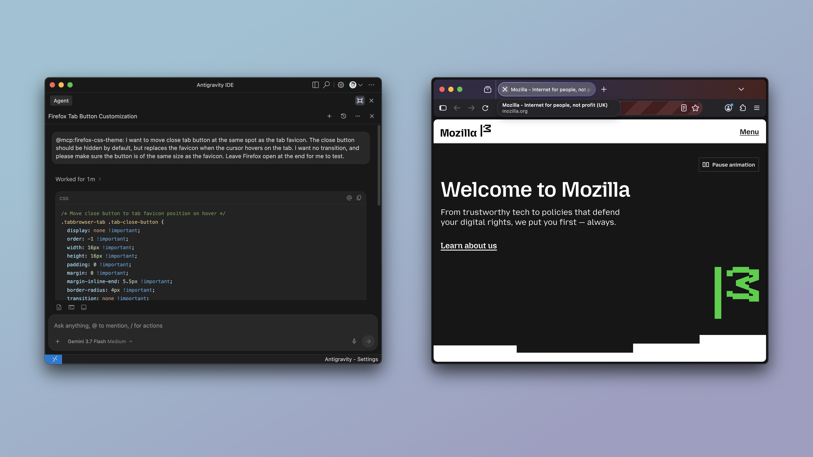

# Firefox CSS Theme

[](https://www.npmjs.com/package/firefox-css-theme)
[](https://github.com/easonwong-de/Firefox-CSS-Theme/actions/workflows/test.yml)

A CLI toolkit for scaffolding, compiling, live-debugging, and watching Firefox UI and CSS themes (`userChrome.css` and `userContent.css`). It also provides a Model Context Protocol (MCP) server for AI-assisted inspection and styling.

## Requirements

- Node.js >= 20
- Firefox Browser

## Getting Started

### Installation

Install as a development dependency within your theme repository:

```bash
npm install --save-dev firefox-css-theme
```

Once installed, run it directly with `npx firefox-css-theme [command] [option]` or use `firefox-css-theme` in your npm scripts:

```json
{
	"scripts": {
		"create": "firefox-css-theme create", // scaffold starter userChrome.css and userContent.css files
		"start": "firefox-css-theme start", // launch Firefox with live stylesheet bundling and hot-reloading
		"profiles": "firefox-css-theme profiles", // list all detected Firefox profiles
		"save": "firefox-css-theme save" // save compiled stylesheets into a Firefox profile's chrome folder
	}
}
```

> [!NOTE]
> `userChrome.css` and `userContent.css` must be located at the project root directory by default; otherwise, specify their paths using the `-c, --chrome` and `-u, --content` options.

For the full list of CLI options, run `npx firefox-css-theme --help` in your project.

## Command Line Interface

### `firefox-css-theme create`

Scaffold starter `userChrome.css` and `userContent.css` boilerplate files with Firefox namespace headers.

#### Usage

```bash
firefox-css-theme create [options]
```

#### Options

| Option                 | Description                                                             |
| ---------------------- | ----------------------------------------------------------------------- |
| `-c, --chrome <path>`  | Custom output path for `userChrome.css` (default: `./userChrome.css`)   |
| `-u, --content <path>` | Custom output path for `userContent.css` (default: `./userContent.css`) |
| `-f, --force`          | Overwrite existing files without confirmation                           |

### `firefox-css-theme start`

Launch Firefox with live stylesheet bundling and hot-reloading.

#### Usage

```bash
firefox-css-theme start [options]
```

#### Options

| Option                 | Description                                                                  |
| ---------------------- | ---------------------------------------------------------------------------- |
| `-p, --profile <name>` | Designate an existing Firefox profile by name (temporary profile if omitted) |
| `-c, --chrome <path>`  | Custom path to `userChrome.css` (default: `./userChrome.css`)                |
| `-u, --content <path>` | Custom path to `userContent.css` (default: `./userContent.css`)              |
| `--no-watch`           | Disable file watching and live reloading                                     |
| `--headless`           | Run Firefox in headless mode                                                 |
| `--nova-ui`            | Enable Firefox Nova UI redesign preferences                                  |
| `--binary <path>`      | Path to custom Firefox executable binary                                     |

### `firefox-css-theme profiles`

List all detected Firefox profiles and their directory paths.

#### Usage

```bash
firefox-css-theme profiles
```

### `firefox-css-theme save`

Compile and save stylesheets directly into a Firefox profile's `chrome/` directory.

#### Usage

```bash
firefox-css-theme save [options]
```

#### Options

| Option                 | Description                                                               |
| ---------------------- | ------------------------------------------------------------------------- |
| `-p, --profile <name>` | Target Firefox profile name (mandatory if multiple profiles exist)        |
| `-c, --chrome <path>`  | Custom path to `userChrome.css` (default: `./userChrome.css`)             |
| `-u, --content <path>` | Custom path to `userContent.css` (default: `./userContent.css`)           |
| `-f, --force`          | Overwrite existing theme files in the profile without confirmation prompt |

> [!WARNING]
> This operation will overwrite existing CSS themes in the profile. A backup is advised.

### `firefox-css-theme mcp`

Start the Model Context Protocol (MCP) server over standard I/O for AI-assisted inspection and styling.

#### Usage

```bash
firefox-css-theme mcp [options]
```

#### Options

| Option                 | Description                                                                           |
| ---------------------- | ------------------------------------------------------------------------------------- |
| `-p, --profile <name>` | Designate an existing Firefox profile by name (isolated temporary profile if omitted) |
| `--nova-ui`            | Enable Firefox Nova UI redesign preferences                                           |
| `--headless`           | Run Firefox in headless mode                                                          |
| `--binary <path>`      | Path to custom Firefox executable binary                                              |

## MCP Server Usage

The MCP server enables AI assistants to inspect the Firefox chrome DOM, query computed styles, inject custom CSS, and capture UI screenshots in real time.



### Configuration

Add the server to your preferred client or development environment:

#### Claude Code

```bash
claude mcp add firefox-css-theme -- npx -y firefox-css-theme mcp --nova-ui
```

#### Codex

```bash
codex mcp add firefox-css-theme -- npx -y firefox-css-theme mcp --nova-ui
```

#### IDE MCP Configuration

Using `npx`:

```json
{
	"mcpServers": {
		"firefox-css-theme": {
			"command": "npx",
			"args": ["-y", "firefox-css-theme", "mcp", "--nova-ui"]
		}
	}
}
```

Or using a local build:

```json
{
	"mcpServers": {
		"firefox-css-theme": {
			"command": "node",
			"args": [
				"/path/to/firefox-css-theme/dist/cli.js",
				"mcp",
				"--nova-ui"
			]
		}
	}
}
```

## Available MCP Tools

- `launch_browser`: Launches Firefox with chrome debugging capabilities enabled.
- `close_browser`: Terminates the browser instance.
- `customize_toolbar`: Activates or controls the Firefox "Customise Toolbar" mode.
- `get_ui_tree`: Dumps the hierarchical DOM tree of the chrome window.
- `query_ui_elements`: Queries elements matching a CSS selector in the browser chrome.
- `get_computed_styles`: Extracts computed CSS property values of a specific UI element.
- `inject_theme_css`: Injects stylesheets in the live UI (`target: "chrome" | "content"`).
- `remove_theme_css`: Removes an injected stylesheet by id (`target: "chrome" | "content"`).
- `list_theme_css`: Lists all currently injected custom stylesheets (`target: "chrome" | "content"`).
- `take_ui_screenshot`: Captures a screenshot of the browser window or a specific UI component.
- `execute_chrome_javascript`: Runs privileged JavaScript in the browser chrome window context.
