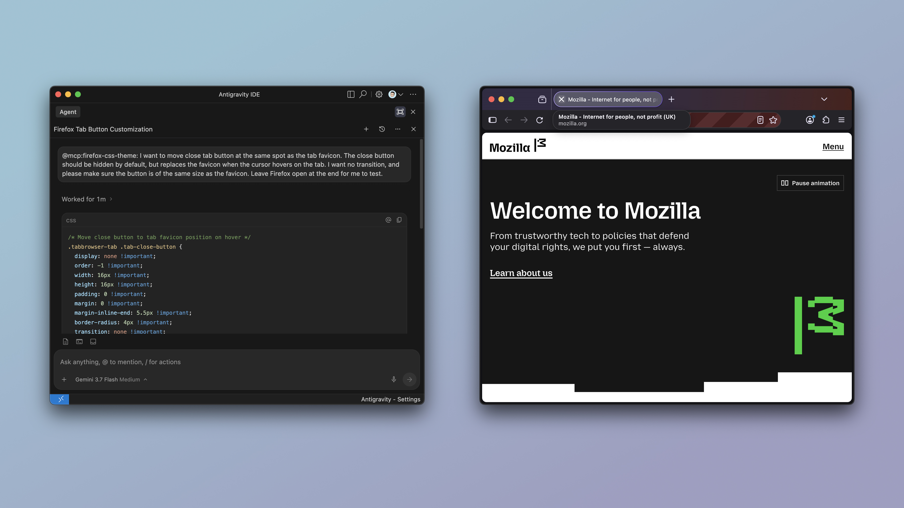

# Firefox CSS Theme

[](https://www.npmjs.com/package/firefox-css-theme)
[](https://github.com/easonwong-de/Firefox-CSS-Theme/actions/workflows/test.yml)

A toolkit for Firefox CSS theme authors to scaffold and live-debug theme repositories. For theme users, it’s an automated theme installer.

A Model Context Protocol (MCP) server is also available for AI-assisted DOM inspection and live styling.

## Getting Started

> [!TIP]
> You need [Node.js](https://nodejs.org/) to get started.

### For Theme Authors

Scaffold a new theme project using `npx`:

```bash
npx firefox-css-theme create
```

This interactively prompts for your theme name and stylesheet targets (`userChrome.css`, `userContent.css`, or both).

If you have already opened the theme project, launch Firefox with live CSS hot-reloading with:

```bash
npx firefox-css-theme start
```

> [!NOTE]
> Theme entry files (`userChrome.css` and/or `userContent.css`) must be located at the root of the project directory.

### For Theme Users

Navigate to the theme directory and install the stylesheets:

```bash
npx firefox-css-theme install
```

The toolkit will look for and install `userChrome.css` and `userContent.css` in the present working directory into your Firefox profile.

If multiple Firefox profiles exist, an interactive selection list will prompt you to choose one.

For the full list of CLI options, run `npx firefox-css-theme --help`.

## MCP Server Usage

The MCP server enables AI assistants to inspect the Firefox chrome DOM, query computed styles, inject custom CSS, and capture UI screenshots in real time.



### Configuration

Add the server to your preferred client or development environment:

#### Claude Code

```bash
claude mcp add firefox-css-theme -- npx -y firefox-css-theme mcp --nova-ui
```

#### Codex

```bash
codex mcp add firefox-css-theme -- npx -y firefox-css-theme mcp --nova-ui
```

#### IDE MCP Configuration

```json
{
	"mcpServers": {
		"firefox-css-theme": {
			"command": "npx",
			"args": ["-y", "firefox-css-theme", "mcp", "--nova-ui"]
		}
	}
}
```

## Available MCP Tools

- `launch_browser`: Launches Firefox with chrome debugging.
- `close_browser`: Terminates the browser instance.
- `customize_toolbar`: Toggles the Firefox "Customise Toolbar" mode.
- `get_ui_tree`: Dumps the hierarchical DOM tree of selected UI element.
- `query_ui_elements`: Queries elements matching a CSS selector in the browser chrome.
- `get_computed_styles`: Extracts computed CSS property values of a specific UI element.
- `inject_theme_css`: Injects a stylesheet in the live UI.
- `remove_theme_css`: Removes an injected stylesheet.
- `list_theme_css`: Lists all currently injected stylesheets.
- `take_ui_screenshot`: Captures a screenshot of a specific UI component.
- `execute_chrome_javascript`: Runs JavaScript in the browser chrome window context.

## Commands

### `firefox-css-theme create`

Scaffold a new Firefox CSS theme project.

#### Usage

```bash
npx firefox-css-theme create [name] [options]
```

#### Options

| Option                  | Description                                 |
| ----------------------- | ------------------------------------------- |
| `-t, --target <target>` | Stylesheet target: both, chrome, or content |
| `-f, --force`           | Proceed without warning                     |

---

### `firefox-css-theme start`

Launch Firefox with live stylesheet bundling and hot-reloading.

#### Usage

```bash
npx firefox-css-theme start [options]
```

#### Options

| Option                 | Description                |
| ---------------------- | -------------------------- |
| `-b, --binary <path>`  | Path to Firefox executable |
| `-p, --profile <name>` | Firefox profile name       |
| `--no-watch`           | Disable file watching      |
| `--headless`           | Run in headless mode       |
| `--nova-ui`            | Enable Firefox Nova UI     |

---

### `firefox-css-theme install`

Install compiled stylesheets from the current working directory into a Firefox profile.

#### Usage

```bash
npx firefox-css-theme install [options]
```

#### Options

| Option                 | Description                     |
| ---------------------- | ------------------------------- |
| `-p, --profile <name>` | Firefox profile name            |
| `-m, --merge`          | Merge with existing stylesheets |
| `-f, --force`          | Proceed without warning         |

> [!WARNING]
> This operation will overwrite existing CSS themes in the profile unless `--merge` is specified. A backup is advised.

---

### `firefox-css-theme mcp`

Start the Model Context Protocol (MCP) server.

#### Usage

```bash
npx firefox-css-theme mcp [options]
```

#### Options

| Option                 | Description                |
| ---------------------- | -------------------------- |
| `-b, --binary <path>`  | Path to Firefox executable |
| `-p, --profile <name>` | Firefox profile name       |
| `--headless`           | Run in headless mode       |
| `--nova-ui`            | Enable Firefox Nova UI     |
